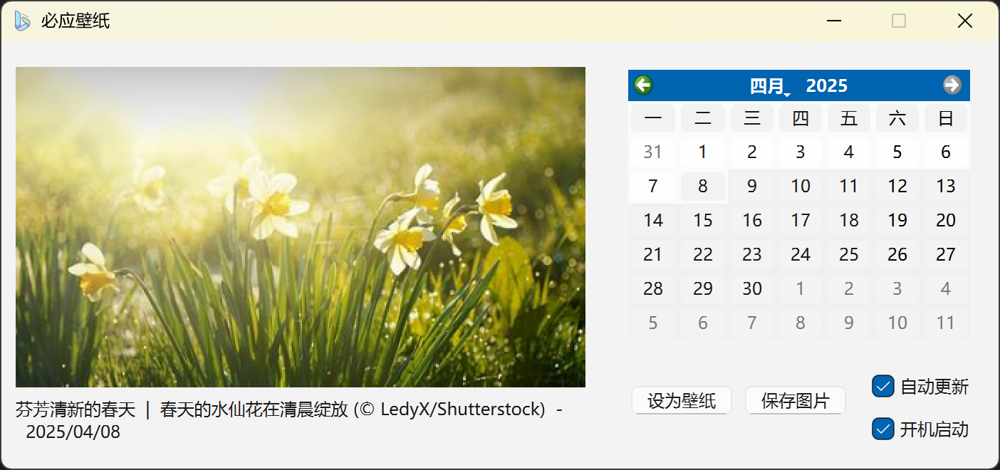

##  必应壁纸 - QT实现

### 🏠软件界面

### 🔦使用

- 点击关闭，最小化到托盘

- 右击托盘图标，点击退出

- 2010/01/01-2018/12/30的图像数据将加载自[https://bing.ee123.net/](https://bing.ee123.net/)，后续日期从bing官方源加载

- 2019/05/09及之前为1080P，之后为4K图像

- 设为壁纸：桌面壁纸，并通过修改注册表更改锁屏壁纸：HKEY_LOCAL_MACHINE\SOFTWARE\Microsoft\Windows\CurrentVersion\PersonalizationCSP

- 保存图片：保存至用户图片文件夹

- 开机启动：将程序添加到注册表：HKEY_CURRENT_USER\SOFTWARE\Microsoft\Windows\CurrentVersion\Run

- 自动更新：点击后立即更新最新壁纸，每15分钟尝试更新一次最新壁纸

### 🛠️实现方式

利用Github Action (Workflow)，每日定时（0:30 UTC+0）通过bing官方api获取图像标题和url并以json文件储存更新到Github仓库；使用Github Page部署作为api访问；点击日历时获取该日期的Github上的json文件，并解析得到图像标题和url，然后本地显示

### ⁉️问题

若出现长时间加载，可能为网络问题，可最小化等待，或尝试重启应用

### ❤️感谢：

2010/01/01-2018/12/30图像数据加载自：[https://bing.ee123.net/](https://bing.ee123.net/)
