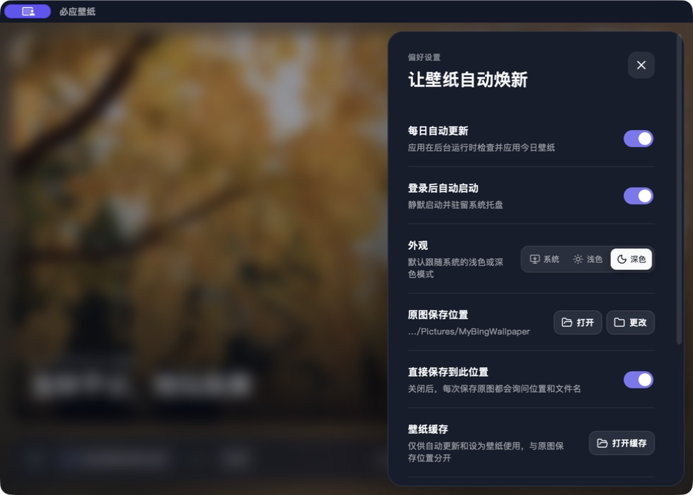

# 必应壁纸 · My Bing Wallpaper

[](https://github.com/hanhuang22/mybingwallpaper/actions/workflows/desktop-build.yml)
[](https://github.com/hanhuang22/mybingwallpaper/actions/workflows/release.yml)

每天从必应壁纸档案中挑选、预览和应用桌面壁纸。应用使用 Tauri 2、React、TypeScript 与 Rust，支持 Windows 和 macOS。

[官方网站](https://hanhuang22.github.io/mybingwallpaper/) · [GitHub 下载](https://github.com/hanhuang22/mybingwallpaper/releases) · [Gitee 国内下载](https://gitee.com/Hyman25/mybingwallpaper/releases)

## 界面预览


<table>
  <tr>
    <td width="50%"></td>
    <td width="50%"></td>
  </tr>
  <tr>
    <td align="center">中文日期选择与历史壁纸浏览</td>
    <td align="center">自动更新与登录启动设置</td>
  </tr>
</table>

## 功能

- 当日、历史日期和随机壁纸浏览
- 保存原图默认直接写入图片目录，也可在设置中更换文件夹或开启每次询问位置
- Windows 与 macOS 桌面壁纸设置
- 系统托盘/菜单栏常驻，关闭窗口不退出
- 每日自动更新与登录后自动启动
- Windows 锁屏壁纸实验功能
- 壁纸说明按需展开，默认保留简洁预览
- 跟随系统浅色/深色外观，也可在设置中手动覆盖
- 签名校验的软件更新，可自动下载并由用户决定何时重启安装
- 一键打开壁纸缓存目录
- 可缩放现代界面与高 DPI 适配

macOS 没有公开的锁屏壁纸设置接口，因此不会显示可用的锁屏开关。Windows 锁屏功能受系统版本、策略和权限影响，失败时不会影响桌面壁纸设置。

点击“保存原图”默认直接保存到系统“图片/MyBingWallpaper”文件夹，文件名为壁纸日期（如 `2026-09-24.jpg`）。可以在设置中查看、打开或更改“原图保存位置”；关闭“直接保存到此位置”后，每次保存都会打开系统保存窗口，可自行选择位置和文件名。更改位置不会搬动此前保存的图片。设置中的“壁纸缓存”仅用于自动更新和设为桌面壁纸，与保存原图的文件夹分开。

## 下载

安装包同时发布到 [GitHub Releases](https://github.com/hanhuang22/mybingwallpaper/releases) 和 [Gitee Releases](https://gitee.com/Hyman25/mybingwallpaper/releases)。GitHub 访问不稳定时可使用 Gitee 国内下载入口：

| 文件名格式 | 适用系统 |
| --- | --- |
| `mybingwallpaper-v<版本>-windows-x64-setup.exe` | Windows 10/11，Intel 或 AMD 64 位（推荐安装程序） |
| `mybingwallpaper-v<版本>-windows-x64.msi` | Windows 10/11，Intel 或 AMD 64 位（MSI） |
| `mybingwallpaper-v<版本>-windows-x86-setup.exe` | 32 位 Windows（安装程序） |
| `mybingwallpaper-v<版本>-windows-x86.msi` | 32 位 Windows（MSI） |
| `mybingwallpaper-v<版本>-windows-arm64-setup.exe` | Windows on ARM（安装程序） |
| `mybingwallpaper-v<版本>-windows-arm64.msi` | Windows on ARM（MSI） |
| `mybingwallpaper-v<版本>-macos-apple-silicon.dmg` | Apple Silicon Mac（M1、M2、M3、M4 等） |
| `mybingwallpaper-v<版本>-macos-intel.dmg` | Intel Mac |

向 `main` 推送代码时，GitHub Actions 会验证上述五种目标能否构建；推送 `v*` 版本标签时，才会创建或更新对应的 GitHub Release，并将同一批安装包同步到 Gitee Release。v0.3.6 是支持应用内自动更新的起始版本，旧版本需要先手动安装一次 v0.3.6 或更高版本。更新包会经过独立签名校验，但这不等同于商业代码签名：Windows 仍可能显示 SmartScreen 提示，macOS 安装包也尚未经过 Apple 公证；首次启动如出现开发者验证提示，请在 Finder 中右键应用并选择“打开”，或前往“系统设置 → 隐私与安全性”选择“仍要打开”。

## 技术结构

```text
src/                    React + TypeScript 界面
src-tauri/src/          Rust 应用核心与 Tauri 桌面端
src-tauri/src/platform/ Windows / macOS 系统适配
src-tauri/capabilities/ 前端权限边界
```

网络下载、文件保存和系统调用都在 Rust 层完成；WebView 只负责界面和用户交互。

## 本地开发

需要 Node.js 24、Rust stable，以及对应平台的系统构建工具。安装依赖时使用锁文件，避免本地与 CI 得到不同版本：

```bash
npm ci
npm test
npm run tauri dev
```

仅调试界面时：

```bash
npm run dev
```

## Windows 构建

### 准备环境

1. 安装 Node.js 24。
2. 通过 rustup 安装 stable MSVC 工具链。
3. 安装 Visual Studio Build Tools 的“使用 C++ 的桌面开发”、Windows 10/11 SDK 和 WebView2 Runtime。
4. 构建 ARM64 时额外安装“适用于 ARM64 的 MSVC C++ 生成工具”和 LLVM/Clang。当前依赖中的 `ring` 在 Windows ARM64 目标上需要 `clang.exe`。
5. 构建 MSI 时确保 Windows 可选功能 VBSCRIPT 已启用。

安装 Rust 编译目标：

```powershell
rustup target add x86_64-pc-windows-msvc
rustup target add i686-pc-windows-msvc
rustup target add aarch64-pc-windows-msvc
```

### 选择架构

| 安装包 | Rust 目标 | 适用场景 |
| --- | --- | --- |
| x64 | `x86_64-pc-windows-msvc` | Intel/AMD 64 位 Windows；ARM64 Windows 也可通过系统的 x64 模拟运行 |
| x86 | `i686-pc-windows-msvc` | 仍需兼容的 32 位 Windows |
| ARM64 | `aarch64-pc-windows-msvc` | ARM Windows 原生版本，ARM 设备优先使用 |

当前在 Windows ARM64 主机上已验证三种目标都能完成 EXE、MSI 和 NSIS 打包。x64/x86 构建使用 Windows 的跨架构工具链；这不代表产物是 ARM64，最终架构由 `--target` 决定。

```powershell
npm ci
npm test

# x64
npm run tauri build -- --target x86_64-pc-windows-msvc

# x86（32 位）
npm run tauri build -- --target i686-pc-windows-msvc

# ARM64
npm run tauri build -- --target aarch64-pc-windows-msvc
```

显式指定目标后，产物位于：

```text
src-tauri/target/<target>/release/my-bing-wallpaper.exe
src-tauri/target/<target>/release/bundle/msi/*.msi
src-tauri/target/<target>/release/bundle/nsis/*-setup.exe
```

`src-tauri/target/` 已被 Git 忽略。可执行文件和安装包只作为 GitHub Release 附件发布，不提交到 Git 历史。未签名的本地构建可能触发 Windows SmartScreen；正式分发建议配置代码签名。

## macOS 构建

```bash
npm run tauri build
```

macOS 会生成 `.app`、带有拖动安装界面的 DMG，以及供应用内更新使用的 `.app.tar.gz` 和签名文件。本项目默认执行完整的 ad-hoc 应用签名，避免下载后的应用包因签名结构不完整而被判断为损坏；若要让安装包无需用户手动放行，仍需 Apple Developer ID 签名与公证。

生成安装包前需在环境变量中提供 Tauri 更新签名私钥与密码；只验证代码能否编译时可使用 `npm run tauri build -- --no-bundle`。更新公钥已经随客户端发布后不要随意更换，否则旧版本将无法验证后续更新。

GitHub Actions 会构建 Windows x64、x86、ARM64，以及 macOS Intel 和 Apple Silicon。推送 `v*` 标签时，发布工作流会同时生成更新包签名和 `latest.json`，发布到 GitHub 后再通过加密的 Gitee API Token 同步到 Gitee，并维护国内可访问的更新清单。发布所需的 `GITEE_API_TOKEN`、`TAURI_SIGNING_PRIVATE_KEY` 和 `TAURI_SIGNING_PRIVATE_KEY_PASSWORD` 只存在于 GitHub Actions Secrets，不会进入源码或安装包；客户端仅包含用于验证签名的公钥。

## 数据源

- 月度元数据：`https://my-bing-wallpaper.oss-cn-beijing.aliyuncs.com/month/YYYYMM.json`
- 2010/01/01—2018/12/30 的历史图片数据来自 [bing.ee123.net](https://bing.ee123.net/)。
- 之后的数据来自必应图片源；有 4K 原图时优先使用 4K 地址。

## 数据维护与 OSS

`.github/workflows/main.yml` 中的定时任务每天检出 `wallpaperarchiv` 分支，运行数据采集脚本，生成月度 JSON 并上传到阿里云 OSS。上传凭据只通过 GitHub Actions Secrets 注入，不进入桌面客户端、源码或安装包。
